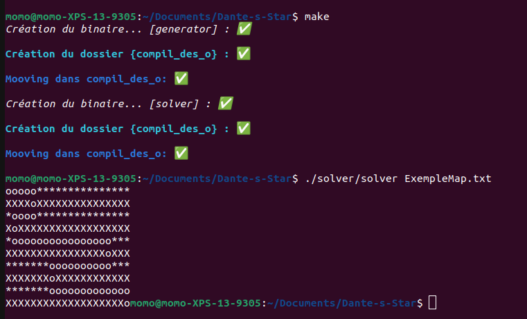

# Dante's Star

Le but de ce projet est de créer un algorithme de générateur de labyrinthe aléatoire. Les espaces libres seront représentés par des '*', et les murs par des 'X'. Le labyrinthe doit être de n'importe quelle taille qui sera donnée en argument du programme.

Le labyrinthe aura toujours pour entrer le coin supérieur gauche avec pour coordonné x et y, (0;0), et pour fin le coin inférieur droit, c'est-à-dire que la dernière case de notre labyrinthe sera toujours représentée par un espace libre donc un '*'.

Une solution est une série de cases libres ('*') et adjacentes, de "début" à la "fin" incluse.

Pour résoudre le labyrinthe, nous utilisons des 'o', pour représenter le chemin de la solution.

Le programme sera séparé en deux partis, la partie Generator et la partie Solver.

## But du programme

Generator : Créer un labyrinthe aléatoire, créer un ficher et écrire le labyrinthe dans le ficher et l'afficher dans le terminal.

Solver : Récuperer un ficher texte contenant un labyrinthe, et trouver la solition en remplaçant les espaces libres par des 'o'.

## Fonctions autorisées

```
	. Toute la libC
```

## Mise en route

Ces instructions vous permettront d'obtenir une copie du projet opérationnel sur votre machine locale à des fins de développement et de test.

### Pré-requis

De quoi avez-vous besoin pour installer le logiciel et comment l'installer ?

```
gcc
make
```

### Installation

Compilation du projet

```
make
```

Lancement du projet

```
Partie Generator :
./generator/generator x y
   x = width
   y = height

Partie Solver :
./solver/solver maze.txt

```

## Captures d'écrans

Création labyrinte imparfait :


Création labyrinte parfait :


Résolution labyrinte :



